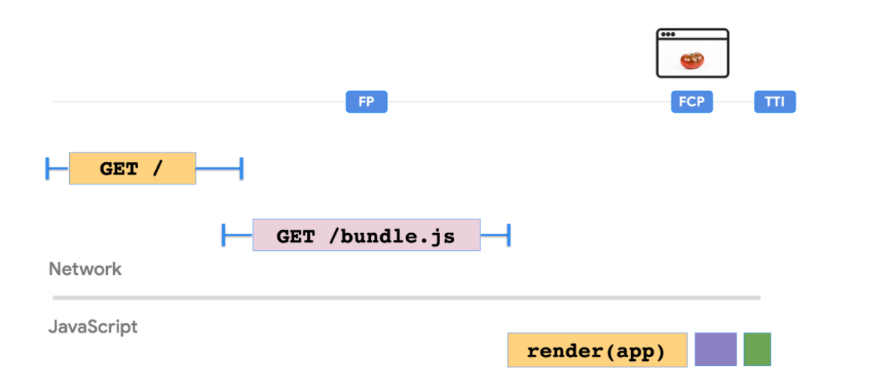

# 客户端渲染 #
在客户端渲染你的UI应用

## 客户端渲染
在客户端渲染(CSR)中，服务器只渲染页面的基本 HTML 容器。显示页面内容所需的逻辑、数据获取、模板和路由由在浏览器/客户端中执行的 JavaScript 代码处理。CSR 作为一种构建单页应用程序的方法变得流行起来。它有助于模糊网站和已安装应用程序之间的区别。
为了更好地理解其他模式提供的好处，让我们首先深入研究客户端渲染(CSR) ，找出它适合应用的场景，它的缺点是什么。

## 客户端渲染(CSR)基本架构

思考一下这个用React构建的[显示和更新当前时间](https://reactjs.org/docs/rendering-elements.html#updating-the-rendered-element)简单例子。

 HTML:
 ```js
 <div id="root"></div>
 ```

 JS:
 ```js
 function tick() {
  const element = (
    <div>
      <h1>Hello, world!</h1>
      <h2>It is {new Date().toLocaleTimeString()}.</h2>
    </div>
  );
 ReactDOM.render(element,document.getElementById('root'));
}
setInterval(tick, 1000);
 ```
 HTML 只包含一个根 div 标签。另一方面，内容显示和更新则完全用 JavaScript 处理。没有到服务器的往返过程，所呈现的 HTML 就地更新。在这里，时间可以被任何其他实时信息所替代，比如从 API 获得的汇率或股票价格，这些信息不需要刷新页面或者往返服务器就可以显示出来。

## Javascript包和性能
 随着页面显示图像、显示来自数据存储的数据以及包括事件处理的复杂性的增加，呈现页面所需的 JavaScript 代码的复杂性和大小也将增加。CSR 产生了大量的 JavaScript 包，增加了页面的 FCP 和 TTI。

 

 如上图所示，随着 bundle.js 大小的增加，FCP 和 TTI 被向前推进。这意味着在 FP 和 FCP 之间的整个过程中，用户将看到一个空白屏幕。

 ## 客户端渲染的优缺点

 使用 React，大部分应用程序逻辑在客户端上执行，它通过 API 调用与服务器交互以获取或保存数据。因此，几乎所有的 UI 都是在客户端上生成的。整个 Web 应用程序在第一次请求时加载。当用户通过单击链接导航时，不会向服务器生成呈现页面的新请求。代码在客户端上运行以更改视图/数据。


CSR 允许我们拥有一个不需要刷新页面就能支持导航的单页应用，并且提供了很好的用户体验。由于更改视图所处理的数据有限，页面之间的路由通常更快，这使得 CSR 应用程序看起来更具响应性。CSR 还允许开发人员实现客户端代码和服务器代码之间的明确分离。

尽管它提供了很好的互动体验，但是这个 CSR 还是有一些缺陷。

**1.搜索引擎优化考虑：** 大多数网络爬虫可以解释服务器呈现的网站以一种直截了当的方式。在客户端呈现为大负载和网络请求瀑布(例如 API 响应)的情况下，事情会变得稍微复杂一些，这可能导致有意义的内容呈现速度不够快，爬虫无法对其进行索引。爬虫程序可能理解 JavaScript，但也有局限性。因此，需要一些变通方法，使客户端呈现的网站搜索引擎优化友好。

**性能** 通过客户端渲染，交互过程中的响应时间得到了极大的改善，因为没有到服务器的往返过程。然而，浏览器要在客户端第一次呈现内容，它们必须等待 JavaScript 首先加载并开始处理。因此，用户在加载初始页面之前会经历一些延迟。这可能会影响用户体验，因为JavaScript包的大小越来越大，并且/或者客户机没有足够的处理能力。

**代码的可维护性** 代码的某些元素可能以不同的语言在客户机和服务器(API)之间重复使用。在其他情况下，业务逻辑的干净分离可能是不可能的。这方面的示例可以包括货币和日期字段的验证和格式化逻辑。

**数据获取** 对于客户端渲染，数据获取通常是事件驱动的。最初可以在没有任何数据的情况下加载页面。随后，可以使用 API 调用在页面加载或按钮单击等事件发生时获取数据。根据数据的大小，这可能会增加应用程序的加载/交互时间。

在不同的应用程序中，这些注意事项的重要性可能不同。开发人员经常感兴趣的是寻找搜索引擎优化友好的解决方案，可以提供更快的网页，而不妥协的互动时间。根据应用程序的需求，分配给不同性能标准的优先级可能不同。有时，通过一些调整使用客户端渲染就足够了，而不需要使用完全不同的模式。
## 提高客户端渲染的性能
由于 CSR 的性能与 JavaScript 包的大小成反比，因此我们能做的最好的事情就是构建 JavaScript 代码以获得最佳性能。下面是可能有帮助的指针列表

**编制JavaScript预算** 确保初始页面加载的 JavaScript 预算相当紧张。最初的捆绑包小于100-170KB，gzip 是一个很好的起点。然后，代码可以根据需要加载特性。

**预加载** 此技术可用于预加载页面在页面生命周期早期需要的关键资源。关键资源可能包括 JavaScript，可以通过在 HTML 的 < head > 部分中包含以下指令来预加载 JavaScript。
```js
<link rel="preload" as="script" href="critical.js">
```
这将告诉浏览器在页面呈现机制启动之前开始加载 Crital.js 文件。因此，脚本将提前可用，不会阻塞页面呈现机制，从而提高性能。

**懒加载** : 使用懒加载，您可以识别非关键的资源，并只在需要时加载这些资源。随着最初加载的资源大小的减少，可以使用这种方法来提高初始页加载时间。例如，在页面加载时通常不需要聊天小部件组件，而且可以懒加载。

**代码分割**: 为了避免大量的 JavaScript 代码，您可以开始分割您的包。代码分割受到像 Webpack 这样的包的支持，它可以用来创建多个可以在运行时动态加载的包。代码分割还使您可以延迟加载 JavaScript 资源。

**使用服务工作者缓存应用程序外壳**: 这种技术包括缓存应用程序外壳，这是支持用户界面的最小的 HTML、 CSS 和 JavaScript。服务工作者可用于脱机缓存应用程序外壳。这对于提供本机单页应用程序体验非常有用，其余内容可以根据需要逐步加载。

有了这些技术，客户端渲染可提供一个更快的单页应用体验与不错的FCP 和 TTI。接下来，我们将看到在另一端服务器端渲染的有什么用处。
