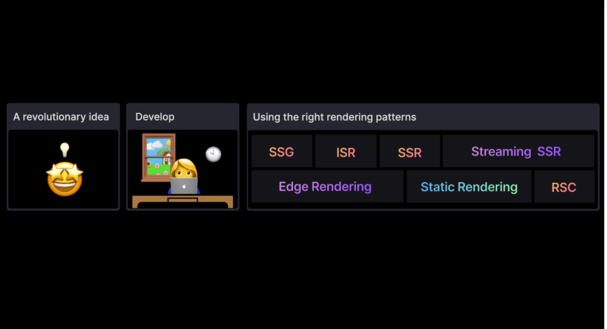
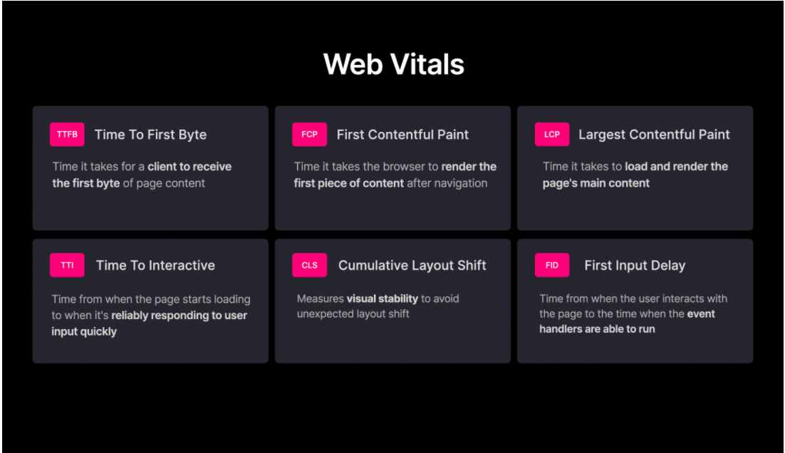
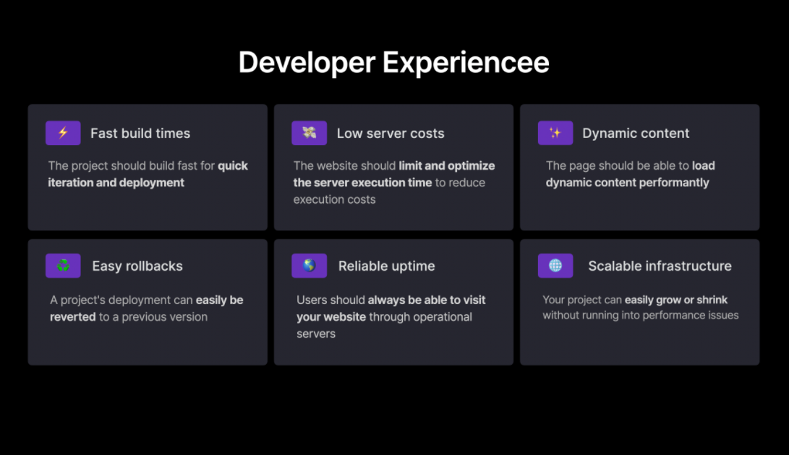
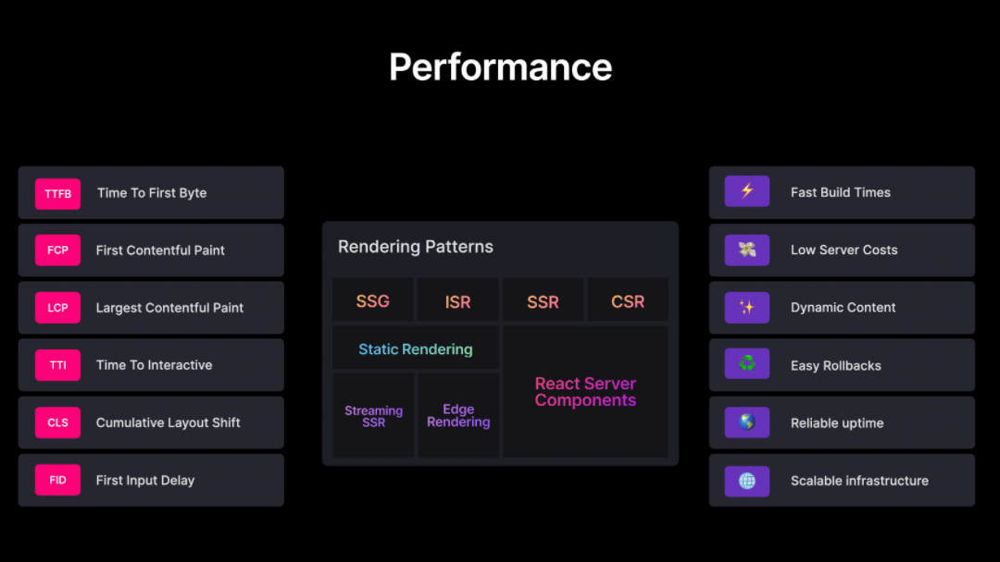
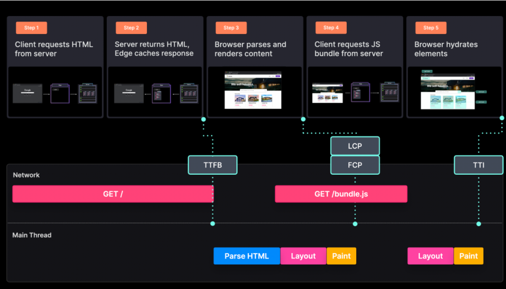
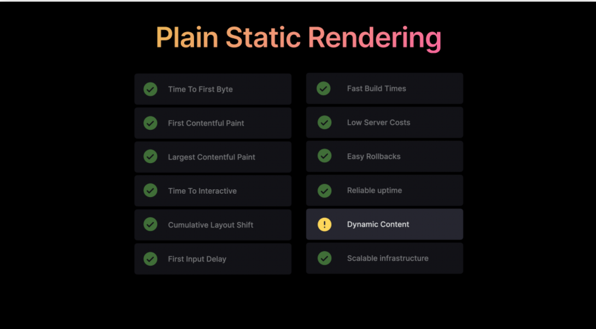
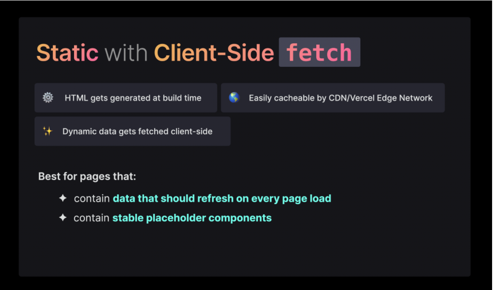
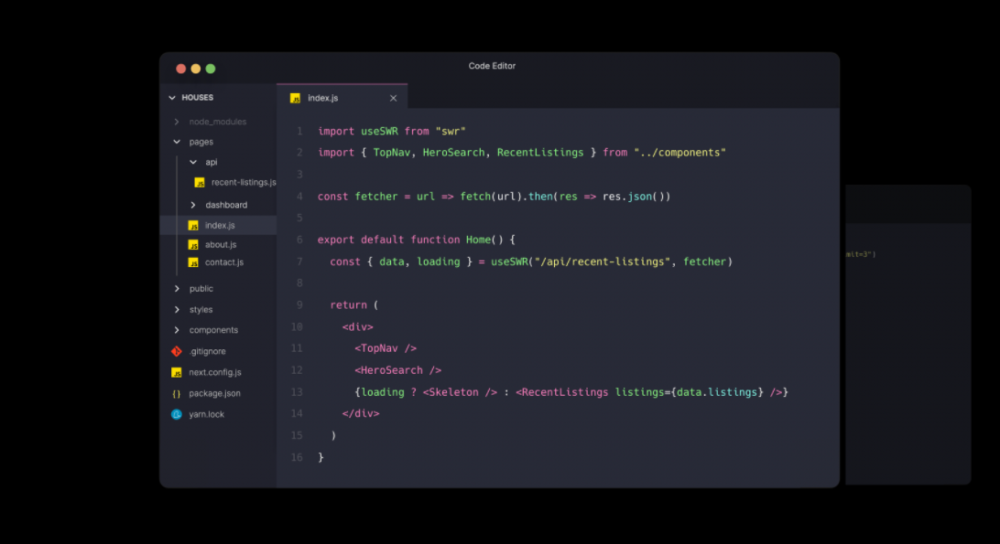

# 介绍
当你开始构建一个应用程序的时候，你所做的基本决定之一是 —— 它应该在 Web 服务器、构建服务器、边缘还是直接在客户端上呈现？它是应该一次性、部分地还是逐步地呈现出来？

这些关键决策的答案很大程度上取决于用例。”选择最合适的渲染模式可以使您为工程团队创建的开发者体验(DX)和为最终用户设计的用户体验(UX)大大受益。

选择正确的模式可以在较低的处理成本下实现更快的构建和出色的加载性能。另一方面，错误的模式选择可能会扼杀一个应用程序，而这个应用程序本来可以实现一个伟大的商业想法。因此，您必须确保您拥有的每一个革命性的想法都以适当的渲染模式进行开发。

## 渲染模式的重要性
为了创建出色的用户体验，我们通常会尝试为以用户为中心的指标优化我们的应用程序，比如[Core Web Vitals(CWV)](https://web.dev/vitals/)。CWV 指标测量参数与用用户体验有很大的关系。优化的 CWV 可以帮助我们的应提供良好的用户体验和搜索引擎优化。

为了给我们的产品/工程团队创建极好开发者体验（DX），我们必须通过更快的构建时间、容易的回滚、可伸缩的基础设施以及许多其他能够帮助开发人员成功的特性来优化我们的开发环境。

建立一个基于这些原则的开发环境可以使我们的开发团队有效地构建一个优秀的产品。

总结我们的期望，我们现在已经建立了一个相当长的列表。但是，如果您选择了正确的渲染模式，就可以立即获得大部分好处。

## 选择一种模式

从服务器端渲染(SSR)和客户端渲染(CSR)到今天在不同论坛上讨论和评判的高度细微差别的渲染模式，渲染模式已经走过了漫长的道路。虽然这可能会让人不知所措，但重要的是要记住，每个模式的设计都是为了处理特定的用例。对一个用例有益的模式特征可能对另一个用例有害。在同一个网站上，不同类型的页面很可能需要不同的渲染模式。

Chrome 团队[鼓励](https://web.dev/rendering-on-the-web/)开发人员考虑静态渲染或服务器端渲染，而不是完全的再水化方法。随着时间的推移，在默认情况下，渐进加载和渲染技术可能有助于在使用现代框架时实现性能和功能交付之间的良好平衡。

接下来的章节将详细介绍不同的模式——新旧皆有。首先，我们简要介绍其中的一些方法，帮助您了解它们在哪些方面最有效。

## 基本/简单的渲染模式
由于静态渲染有很多变体，我们称之为前面讨论过的主要技术——平面静态渲染。您可以将其用于几乎没有动态内容的页面

下面的房地产网站演示中的页面总是向全球的每个人显示相同的内容。它不包含任何动态数据或个性化内容。

当部署和构建站点时(例如，在 Vercel 上) ，相应的 HTML 将生成并保存在服务器上的静态存储中。

当用户请求页面时，服务器将预生成的 HTML 发送给客户端。此响应也缓存到最接近用户的边缘位置。然后浏览器呈现 HTML 并使用 JavaScript 包来补充页面。

纯静态渲染对性能非常有利，因为它会有更短的TTFB（首字节时间，访问目标网站时，从发出请求到自己电脑获得网站响应的首字节这段时间）非常快，因为服务器上已经有 HTML 了。浏览器接收到一个更快的响应，可以很快地呈现它，从而有了更短的 FCP（白屏时间，指的是用户在浏览器中打开页面到渲染第一个DOM元素所花费的时间） 和 LCP（最大内容渲染速度）。因为内容是静态的，所以在呈现它的时候没有布局变化。

因此，简单的静态渲染，特别是使用 CDN 进行缓存，有助于实现Core Web Vitals。然而，大多数网站或多或少都会有一些动态内容或用户交互。

## 基于客户端提取的静态渲染

比方说，我们希望增强我们的房地产演示，以显示最新的房地产清单。我们得找个数据提供商才能拿到这些清单。

在这种情况下，我们可以使用基于客户端提取的静态渲染。当您希望每次请求都更新数据时，此模式非常有用.

您仍然可以对网站使用静态呈现，以呈现具有框架组件的 UI，您希望在其中放置动态列表数据。然后，在页面加载之后，我们可以在客户端上获取数据(例如，使用 SWR)。

自定义 API 路由用于从 CMS 获取数据并返回这些数据。

当用户请求页面时，预生成的 HTML 文件被发送到客户端。用户最初在没有任何数据的情况下看到框架 UI。客户机从 API 路由获取数据，接收响应，并显示清单。(示例中没有包含水合调用)是响应，并显示了列表。(例子中不包括水合调用)
