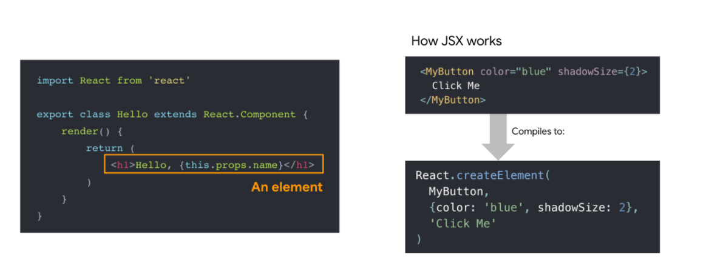
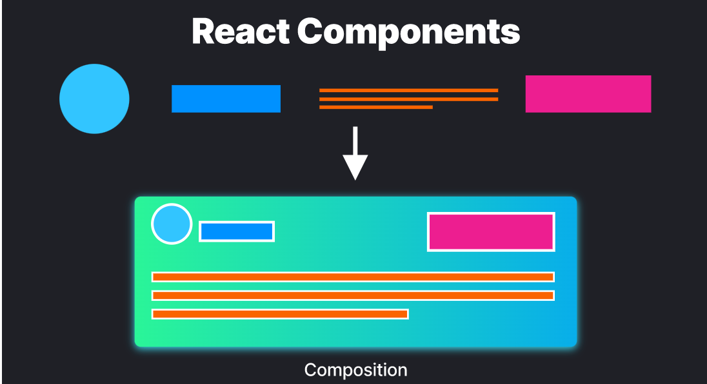
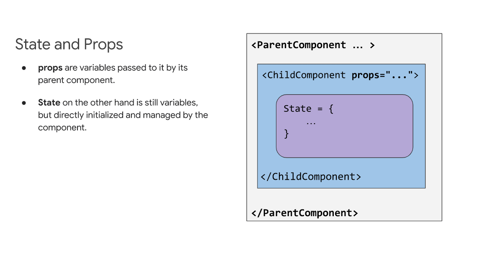
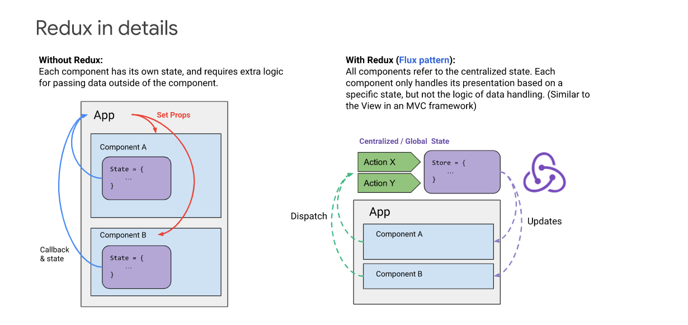
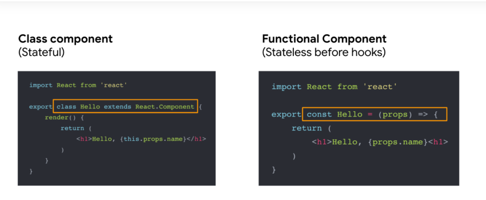
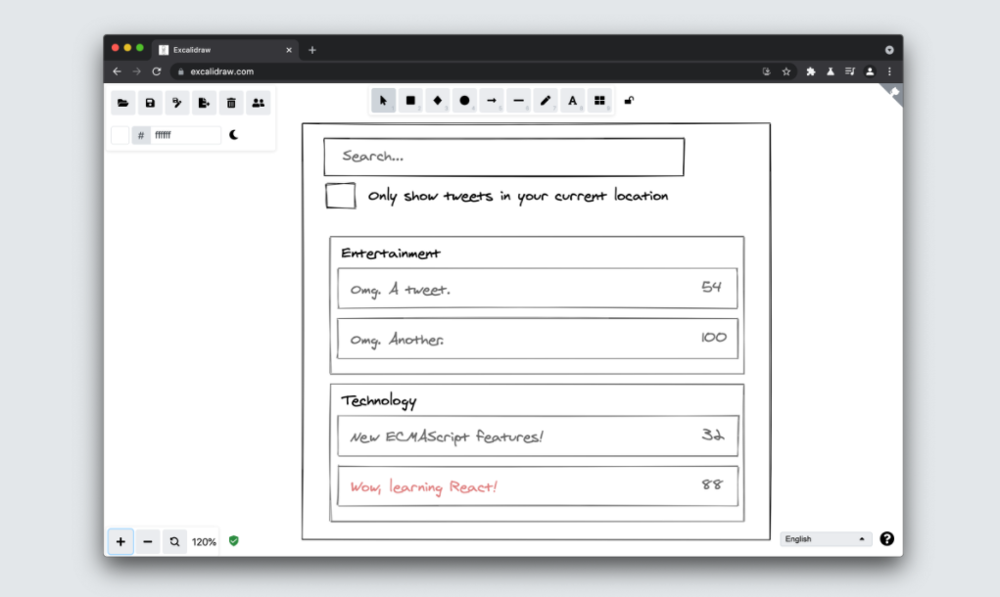
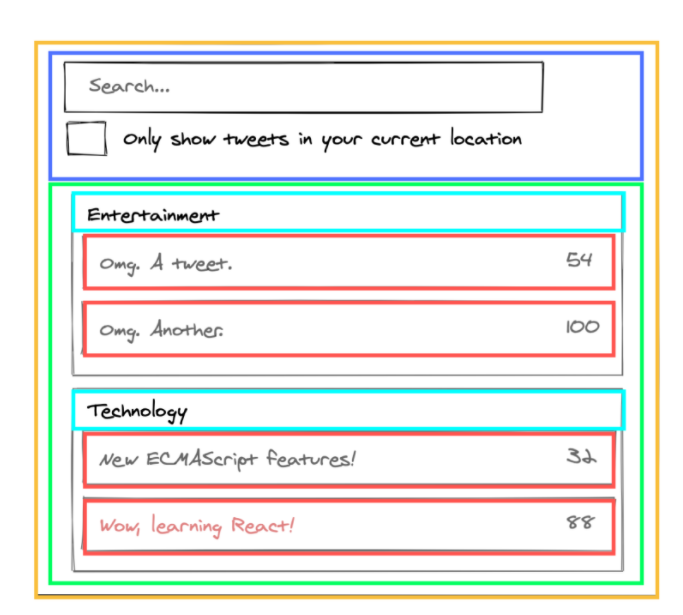

# React 概述
用于构建可重用用户界面组件的 UI 库

## React 介绍
这些年来，人们越来越需要直接使用 JavaScript 编写用户界面的方法。React 也称为 React.js，是由 Facebook 设计的开源 JavaScript 库，用于构建用户界面或 UI 组件。
React 当然不是唯一的 UI 库。Preact、 Vue、 Angular、 Svelte、 Lit 和许多其他工具也非常适合用于从可重用元素构成接口。考虑到 React 的受欢迎程度，我们有必要详细介绍一下它是如何工作的，因为我们将在本指南中使用它来介绍一些设计、渲染和性能模式。

当前端开发人员谈论代码时，通常是在为 Web 设计界面的上下文中。我们考虑界面组合的方式是在元素中，比如按钮、列表、导航等等。React 提供了一种优化和简化的方式来表达这些元素中的接口。它还通过将界面组织成三个关键概念(**components**, **props**和**state**)来帮助构建复杂而棘手的界面。

因为 React 是以组合为中心的，所以它可以完美地映射到您的设计系统的元素。所以，本质上，为 React 设计实际上是奖励你用模块化的方式思考。它允许您在组装页面或视图之前设计单个组件，这样您就可以完全理解每个组件的范围和用途ーー这个过程称为组件化。

## 我们将使用的术语

   - React / React.js / ReactJS  2013年由 Facebook 创建的 React库
   - ReactDOM - 用于DOM和服务器渲染的包
   - JSX - JavaScript 的语法扩展
   - Redux - 集中状态容器
   - Hooks - 一种不用编写类就可以使用状态和其他 React 特性的新方法
   - ReactNative - 用 Javascript 开发跨平台本地应用程序的库
   - Webpack-JavaScript  - js打包工具，在 React 社区中非常流行。
   - CRA (Create React App)  - 一个 CLI 工具，创建一个React脚手架应用程序启动一个项目。
   - Next.js- 一个 React 框架，具有许多同类中最好的特性，包括 SSR、代码分割、性能优化等等。

##  用JSX渲染
我们将在许多示例中使用 JSX。JSX 是 JavaScript 的扩展，它使用类 XML 语法将模板 HTML 嵌入到 JS 中。它意味着要转换成有效的 JavaScript，尽管这种转换的语义是特定于实现的。JSX 因 React 库而流行起来，但是之后也看到了其他的实现。



## Components, Props, and State
components, props, and state是React 中的三个关键概念。实际上，你在React中将要看到或者做到的每件事情都可以归类为至少一个关键概念，下面我们来快速浏览一下这些关键概念:
 ### 1.Components

组件是任何 React 应用程序的构建块。它们类似于 JavaScript 函数，接受任意输入(Props)并返回描述应该在屏幕上显示什么的 React 元素。

首先要理解的是，React 应用程序屏幕上的所有东西都是组件的一部分。本质上，React 应用程序只是组件中的组件。因此，开发人员不会在 React 中构建页面，而是构建组件.

组件允许您将 UI 分割成独立的、可重用的部分。如果您习惯于设计页面，那么以这种模块化的方式思考似乎是一个很大的变化。但是如果你使用设计系统或者风格指南呢？那么，这可能不会像看上去那样是一个重大的范式转变。

定义组件最直接的方法是编写一个 JavaScript 函数。
```js
function Badge(props) {
  return <h1>Hello, my name is {props.name}</h1>;
}
```
这个函数是一个有效的 React 组件，因为它接受一个带有数据的 prop (表示属性)对象参数，并返回一个 React 元素。这样的组件被称为“函数组件”，因为它们实际上是 JavaScript 函数。

除了函数组件之外，另一种类型的组件是“类组件”类组件不同于函数组件，因为它是由 ES6类定义的，如下所示:

```js
class Badge extends React.Component {
  render() {
    return <h1>Hello, my name is {this.props.name}</h1>;
  }
}
```
**提取组件**
为了说明组件可以拆分为更小组件的事实，请考虑以下 `Tweet`组件:


实现方式如下：
```js
function Tweet(props) {
  return (
    <div className="Tweet">
      <div className="User">
        
        <div className="User-name">
          {props.author.name}
        </div>
      </div>
      <div className="Tweet-text">
        {props.text}
      </div>
      
      <div className="Tweet-date">
        {formatDate(props.date)}
      </div>
    </div>
  );
}
```

这个组件可能有点难以操作，因为它是集群化的，并且重用它的各个部分也是困难的。但是，我们仍然可以从中提取出一些组件。

首先我们提取`Avatar`组件

```js
function Avatar(props) {
    return (
      
    );
  }
```

`Avatar`并不需要知道在`评论内容`里面是如何被渲染的，这就是为什么我们给props一个很【冈的名字， user 而不是 author.

现在我们将简化一下评论:
```js
function Tweet(props) {
  return (
    <div className="Tweet">
      <div className="User">
        <Avatar user={props.author} />
        <div className="User-name">
          {props.author.name}
        </div>
      </div>
      <div className="Tweet-text">
        {props.text}
      </div>
      
      <div className="Tweet-date">
        {formatDate(props.date)}
      </div>
    </div>
  );
}
```
接下来我们提取`User`组件，渲染用户头像和它旁边的用户名
```js
function User(props) {
  return (
    <div className="User">
      <Avatar user={props.user} />
      <div className="User-name">
        {props.user.name}
      </div>
    </div>
  );
}
```
现在我们又进一步简化了`Tweet`

```js
function Tweet(props) {
  return (
    <div className="Tweet">
      <User user={props.author} />
      <div className="Tweet-text">
        {props.text}
      </div>
      
      <div className="Tweet-date">
        {formatDate(props.date)}
      </div>
    </div>
  );

```

提取组件看起来是一项单调乏味的工作，但是拥有可重用的组件使得为更大的应用程序编写代码变得更加容易。在简化组件时需要考虑的一个很好的标准是: 如果你的 UI 的一部分被多次使用(按钮，面板，阿凡达) ，或者它本身足够复杂(应用程序，FeedStory，评论) ，那可以考虑将它提取为一个单独的组件。

### 2. Props ###

props是属性的简短形式，它们只是在 React 中引用组件的内部数据。它们被写入组件调用中，并被传递到组件中。它们还使用与 HTML 属性相同的语法，例如 _ prop = “ value”。关于props有两点值得记住: 首先，我们确定props的值，并在构建组件之前将其作为蓝图的一部分使用。其次，props的值永远不会改变，也就是说，一旦props被传递到组件中，它们就是只读的。

访问props的方法是通过每个组件都可以访问的“ this.props”属性来引用它。

### 3. State ###
状态是一个对象，它包含一些可能在组件的生命周期中更改的信息。这意味着它只是存储在组件道具中的数据的当前快照。数据可以随着时间的推移而变化，因此需要使用一些技术来管理数据变化的方式，以确保组件在恰当的时间看起来符合工程师的要求ーー这就是所谓的状态管理。



阅读一段关于React的文章，几乎不可能不碰到“状态管理”的概念。开发人员喜欢详细阐述这个主题，但是在其核心，状态管理并不像听起来那么复杂。

在 React 中，还可以全局跟踪状态，并且可以根据需要在组件之间共享数据。从本质上说，这意味着在 React 应用程序中，在新的地方加载数据并不像在其他技术中那样昂贵。React 应用程序在保存和加载数据以及何时保存和加载数据方面更加聪明。这为创建以新方式使用数据的接口提供了机会。

可以将 React 组件想象成具有自己的数据、逻辑和表示的微应用程序。每个组件都应该有一个单一的用途。作为一名工程师，您可以决定这个目的，并完全控制每个组件的行为以及使用什么数据。您不再受页面其余部分数据的限制。在您的设计中，您可以以各种方式利用这一点。有机会提供额外的数据，可以改善用户体验或使设计中的领域更具有上下文关系。

**如何在React中添加状态**

在设计，包括状态是一个任务，您应该保存到最后。尽可能使用props和事件来设计无状态的一切要好得多。这使得组件更容易维护、测试和理解。添加状态应该通过状态容器(如 Redux 和 MobX)或容器/包装器组件来完成。Redux 是用于其他react框架的流行状态管理系统。它实现了一个由操作驱动的集中式状态机。


在下面的示例中，状态的位置可以是 LoginContainer 本身。让我们使用 React Hook (这将在下一节中讨论) :

```js
const LoginContainer = () => {
  const [username, setUsername] = useState("");
  const [password, setPassword] = useState("");

  const login = async event => {
    event.preventDefault();
    const response = await fetch("/api", {
      method: "POST",
      body: JSON.stringify({
        username,
        password,
      }),
    });
    // Here we could check response.status to login or show error
  };

  return (
    <LoginForm onSubmit={login}>
      <FormInput
        name="username"
        title="Username"
        onChange={event => setUsername(event.currentTarget.value)}
        value={username}
      />
      <FormPasswordInput
        name="password"
        title="Password"
        onChange={event => setPassword(event.currentTarget.value)}
        value={password}
      />
      <SubmitButton>Login</SubmitButton>
    </LoginForm>
  );
};
```

如果需要更多的例子，请参见[Thinking in React 2020](https://dev.to/laserreindeer/thinking-in-react-the-2020-version-4c18)。

### Props vs State ###
props和state有时可以混为一谈，因为他们是如此相似。以下是它们之间的一些关键区别:

| Syntax      | Description |
| ----------- | ----------- |
| 每个组件之间的数据保持不变。     | 数据是存储在组件props中的数据的当前快照。它在组件的生命周期中发生变化。      |
| 数据只读   | 数据可能是异步的    |
|props数据不能修改| 数据可以通过this.setState更改|
|props在组件之间传递| state在组件中被管理|

## 其他React概念 ##

### 1.生命周期 ###
每个反应部件都要经历三个阶段: 挂载、渲染和卸载。在这三个阶段中发生的一系列事件可以称为组件的生命周期。虽然这些事件部分地与组件的状态(其内部数据)相关，但生命周期略有不同。React 具有根据需要加载和卸载组件的内部代码，并且一个组件可以在该内部代码中存在多个使用阶段。
There are a lot of lifecycle methods, but the most common ones are:

有很多生命周期方法，但最常见的是:
Render ()-这个方法是 React 中类组件中唯一需要的方法，也是最常用的方法。顾名思义，它处理组件向 UI 的呈现，并且在组件的挂载和渲染阶段发生。

当创建或删除组件时:
  - **componentDidMount()** 在组件输出呈现到 DOM 之后运行
  - ** componentWillUnmount() ** 在卸载和销毁组件之前立即调用
  当props或state更新:
  - **shouldComponentUpdate()** 当接收到新的props或state时，在渲染之前调用。
  - **componentDidUpdate()** 在更新发生后立即调用。初始呈现不调用此方法。

  ### 2.高阶组件 ###

  高阶组件(HOC)是 React 中用于复用组件逻辑的一种高级技术。意味着高阶组件是一个接受组件并返回新组件的函数。它们是从React的组成性质中产生的模式。当一个组件将props转换为 UI 时，高阶组件将一个组件转换为另一个组件，而且它们往往在第三方库中很流行

 ### 3.Context ###
在一个典型的 React 应用程序中，数据通过props传递，但是对于React程序中的许多组件所需的某些类型的props来说，这可能会很麻烦。上下文提供了一种在组件之间共享这些类型数据的方法，而不必显式地在每个层次结构传递props。这意味着使用Context，我们可以避免通过中间元素传递props。

## React Hooks ##

钩子是允许您从功能组件“钩入”React 状态和生命周期特性的函数。它们允许您在不编写类的情况下使用状态和其他 React 特性。你可以在我们的[钩子指南](https://www.patterns.dev/posts/hooks-pattern/)中了解更多关于钩子的信息。



## React 的思考 ##

React 真正令人惊奇的一点是，它让你在构建应用程序时思考它们。在本节中，我们将带领您完成使用 React Hooks 构建可搜索产品数据表的思想过程。

**步骤1: 从一个模拟开始**假设我们已经有了一个 JSON API 和一个模拟接口:

我们的 JSON API 返回的一些数据如下:
```js
[
  {category: "Entertainment", retweets: "54", isLocal: false, text: "Omg. A tweet."},
  {category: "Entertainment", retweets: "100", isLocal: false, text: "Omg. Another."},
  {category: "Technology", retweets: "32", isLocal: false, text: "New ECMAScript features!"},
  {category: "Technology", retweets: "88", isLocal: true, text: "Wow, learning React!"}
];
```
提示: 您可能会发现像 [Excalidraw](https://excalidraw.com/) 这样的免费工具对于绘制 UI 和组件的高级模拟非常有用。

### 步骤2:用户界面分解成一个层次结构组件 ###
在完成模拟之后，下一步要做的事情是在模拟中的每个组件(和子组件)周围绘制一个框，并为所有组件命名，如下所示。

使用单一责任原则: 理想情况下，组件应该具有单一功能。如果组件变大了，它应该被分解成更小的子组件。使用相同的技术来决定是否应该创建一个新函数或对象。


你可以在上面的图片中看到我们的应用程序有五个组件。我们已经列出了每个组件所代表的数据。
- **TweetSearchResults (橘色)** ：整个组件的容器
 - **SearchBar (蓝色)**： 用户输入要搜索的内容
  - **TweetList  (绿色)** 根据用户输入显示和过滤 tweets
  - **TweetCategory (青绿色)** 显示每个类别的标题
  - **TweetRow  (红色)** 每行显示每个tweet

既然模拟中的组件已经被识别出来了，接下来要做的事情就是将它们排序到一个层次结构中。在模拟中的另一个组件中找到的组件应作为子组件出现在层次结构中。像这样:

- **TweetSearchResults**
  - **SearchBar**
  - **TweetList**
  - **TweetCategory**
    - **TweetRow**

步骤3: 在 React 中实现组件完成组件层次结构后的下一步是实现您的应用程序。在去年之前，最快的方法是建立一个版本，采用你的数据模型和呈现界面，但没有交互性，但自从反应钩子的介绍，一个更容易的方法来实现你的应用程序是使用钩子，如下所示:

i **可过滤的tweets列表**

```js
const TweetSearchResults = ({tweets}) => {
  const [filterText, setFilterText] = useState('');
  const [inThisLocation, setInThisLocation] = useState(false);
  return (
    <div>
      <SearchBar
        filterText={filterText}
        inThisLocation={inThisLocation}
        setFilterText={setFilterText}
        setInThisLocation={setInThisLocation}
      />
      <TweetList
        tweets={tweets}
        filterText={filterText}
        inThisLocation={inThisLocation}
      />
    </div>
  );
}
```

**ii.SearchBar**

```js
const SearchBar = ({filterText, inThisLocation, setFilterText, setInThisLocation}) => (
  <form>
    <input
      type="text"
      placeholder="Search..."
      value={filterText}
      onChange={(e) => setFilterText(e.target.value)}
    />
    <p>
      <label>
        <input
          type="checkbox"
          checked={inThisLocation}
          onChange={(e) => setInThisLocation(e.target.checked)}
        />
        {' '}
        Only show tweets in your current location
      </label>
    </p>
  </form>
);
```

**iii. Tweet list (list of tweets)**

```js
const TweetList = ({tweets, filterText, inThisLocation}) => {
  const rows = [];
  let lastCategory = null;

  tweets.forEach((tweet) => {
    if (tweet.text.toLowerCase().indexOf(filterText.toLowerCase()) === -1) {
      return;
    }
    if (inThisLocation && !tweet.isLocal) {
      return;
    }
    if (tweet.category !== lastCategory) {
      rows.push(
        <TweetCategory
          category={tweet.category}
          key={tweet.category} />
      );
    }
    rows.push(
      <TweetRow
        tweet={tweet}
        key={tweet.text} />
    );
    lastCategory = tweet.category;
  });

  return (
    <table>
      <thead>
        <tr>
          <th>Tweet Text</th>
          <th>Retweets</th>
        </tr>
      </thead>
      <tbody>{rows}</tbody>
    </table>
  );
}
```

**iv. Tweet category row**

```js
const TweetCategory = ({category}) => (
  <tr>
    <th colSpan="2">
      {category}
    </th>
  </tr>
);
```

**v. Tweet Row**
```js
const TweetRow = ({tweet}) =>  {
  const color = tweet.isLocal ? 'inherit' : 'red';

  return (
    <tr>
      <td><span style="">{tweet.text}</span></td>
      <td>{tweet.retweets}</td>
    </tr>
  );
}
```
最终的实现将是在前面提到的层次结构中一起编写的所有代码:

- **TweetSearchResults**
  - **SearchBar**
  - **TweetList**
  - **TweetCategory**
    - **TweetRow**

## 准备开始 ##
开始使用 React 有多种方式。

**直接在网页上加载**: 这是设置 React 的最简单方法。将 React JavaScript 作为 npm 依赖项或通过 CDN 添加到页面。

**使用 create-response-app**: create-react-app 是一个旨在让你尽快使用 React 的项目，任何一个 React 应用只需要一个页面就可以轻松满足你的需求。更正式的生产应用程序应该考虑使用 Next.js，因为它内置了更强的默认值(比如代码分割)。

**代码沙箱**: 一个简单的方法来创建React应用程序的结构，无需安装它，是去 https://codesandbox.io/s 和选择“React”

**Codepen**: 如果您正在开发一个 React 组件的原型并且喜欢使用 Codepen，那么还可以使用许多 React 起点。

## 总结 ##

React.js库的设计目的是使构建模块化的、可重用的用户界面组件的过程简单而直观。当您阅读我们的其他一些指南时，我们希望您会发现这个简短的介绍是一个有用的高级概述。
如果你有兴趣进一步阅读有关React的基本原理，请参阅:
 - [官方文档](https://reactjs.org/docs/getting-started.html#learn-react)
  - [设计师的React](https://reactfordesigners.com/)

  如果没有官方的 React [component和props](https://reactjs.org/docs/components-and-props.html)、 [React 中的思维](https://dev.to/laserreindeer/thinking-in-react-the-2020-version-4c18)、 [React Hooks中的思维](https://davidpfahler.com/thinking-in-react-hooks) 以及[脚本文档](https://scriptverse.academy/tutorials/reactjs-pass-props-to-functional-component.html)中共享的教学风格，本指南是不可能完成的.
